# Aaron’s World — a playable portfolio

A game-inspired portfolio for **Aaron David Ramírez Lezama**, Senior Software Engineer (10+ years, 8 years of front end).
The career map is a side-scrolling platformer: run and jump through the worlds, grab the stars, dock at each place to see what was built. Recruiters get a plain-text mode one click away.

React 18 · TypeScript · Vite · Framer Motion · CSS sprite animation · a small canvas for particles.

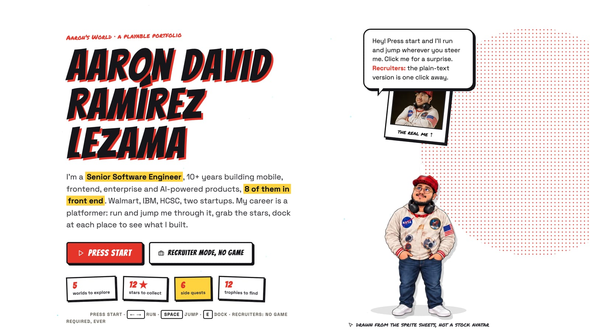

## Screenshots

### The Career Run

| | |
| --- | --- |
| 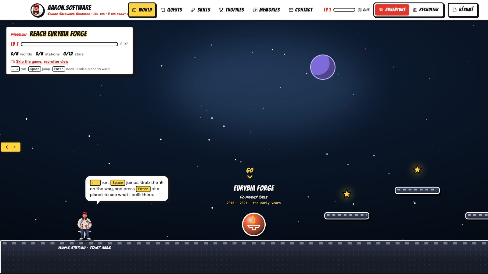 | 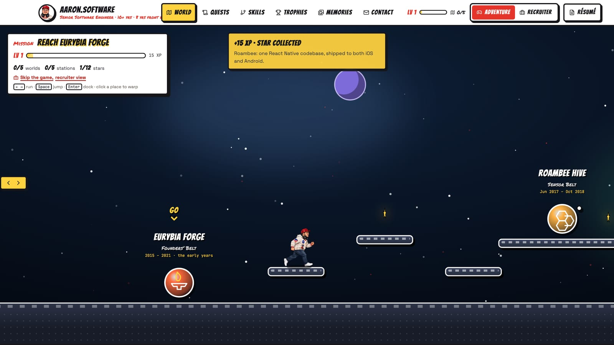 |
| 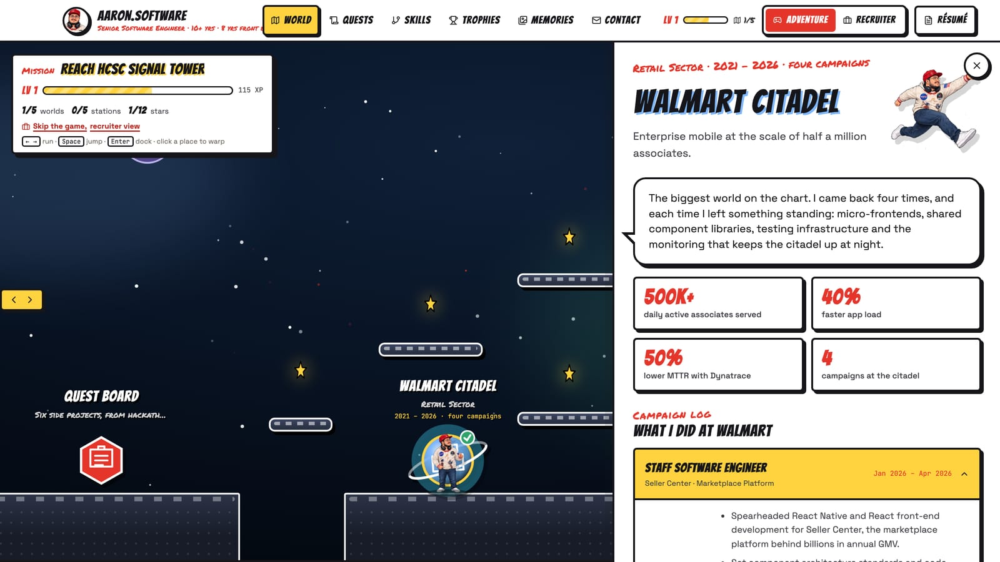 | 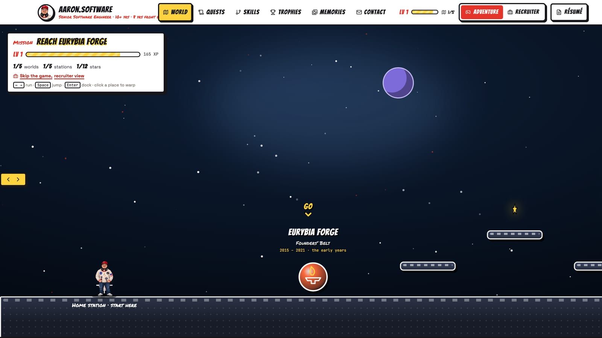 |

### Quests, skills, trophies, memories

| | |
| --- | --- |
| 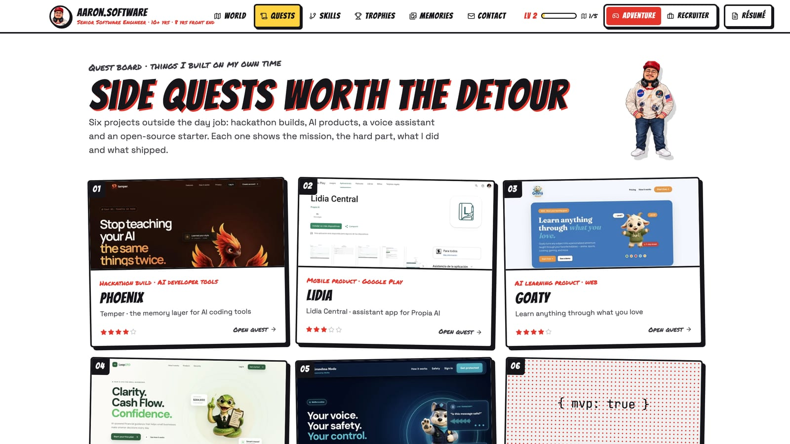 | 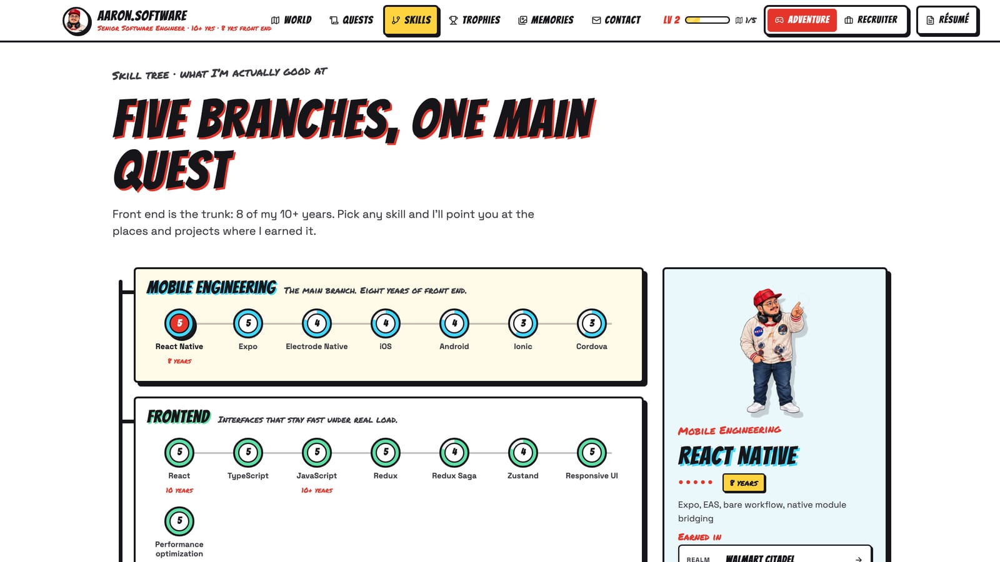 |
| 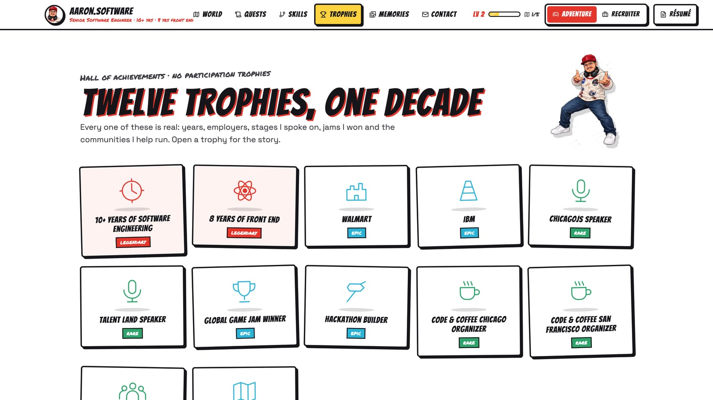 | 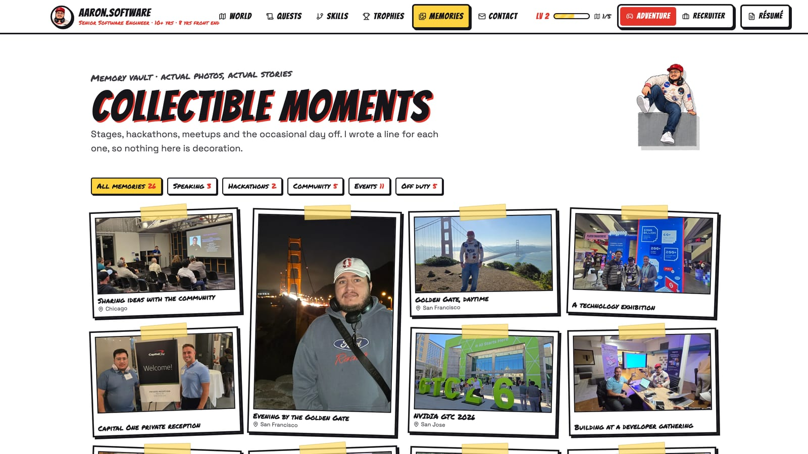 |

### Recruiter mode

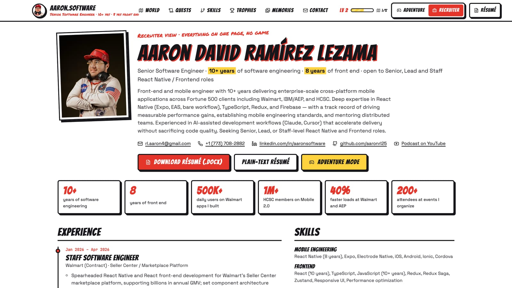

### On the phone

<p>
  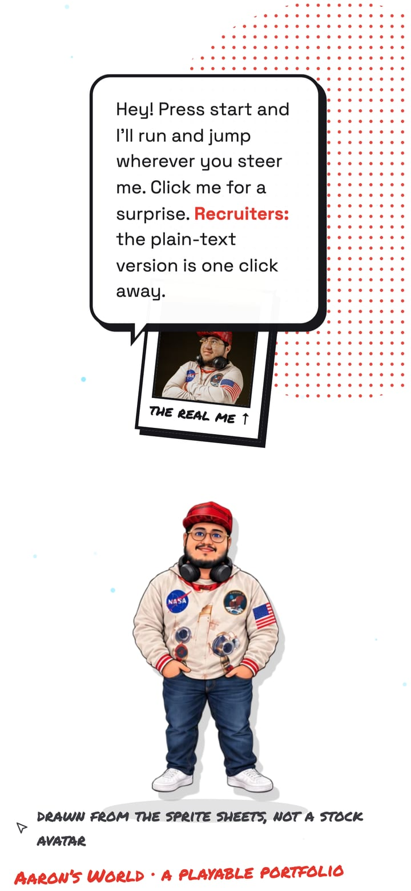
  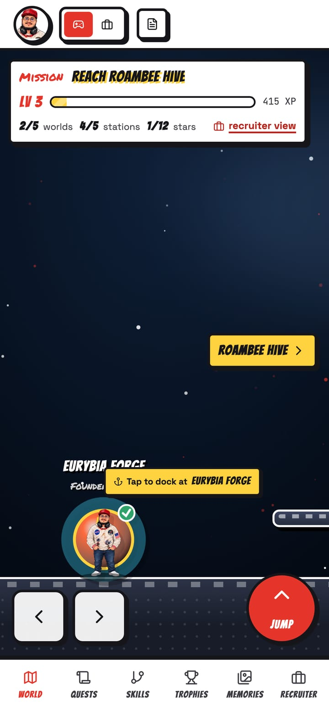
</p>

## Design

The visual system is a comic book built around Aaron’s sprite sheets: paper and ink, hard offset shadows, halftone, speech bubbles in first person, taped polaroids for photographs, Bangers for headlines and Permanent Marker for hand-written labels. Tokens live in `src/styles/game.css`.

## Run

```bash
npm install
npm start            # Vite dev server on http://127.0.0.1:5173
npm run build        # type-check, build dist/, and write a static HTML entry for every route
npm run preview
```

## Modes and routes

| Route | Screen |
| --- | --- |
| `/` | Game loader → title screen: press start, or continue from the save file (level, XP, worlds, stars, quests) |
| `/world`, `/world/:id` | The Career Run, a side-scrolling platformer: arrows/A-D run, Space/W/Up jumps (coyote time, jump buffering, variable height), one-way platforms, two pits that respawn you, stars a jump above the platforms award XP and reveal a fact, Enter docks at the nearest world or station, clicking a place warps there. Touch controls on phones. A mission bar shows the next objective, level and progress, with an edge pointer when the objective is off-screen. Fast travel sits below |
| `/quests`, `/quests/:id` | Quest board and quest logs (Phoenix, Lidia, Goaty, LoopCFO, Grandma Mode, RN MVP Boilerplate) |
| `/skills` | RPG skill tree, five branches |
| `/achievements` | Hall of achievements |
| `/memories` | Memory vault (photographs with stories) |
| `/recruiter` | Recruiter mode: everything as plain text, résumé download, print styles |
| `/contact` | Contact portal |

Recruiter mode never requires a game interaction; the HUD toggle, the title screen and the mission bar all link to it.

Progress (`src/lib/progress.ts`) is saved in localStorage: visited worlds (100 XP), stations (50), opened quests (25) and collected stars (15); a level is 200 XP. Star facts live in `src/data/world.ts` (`collectibles`); the level layout (platforms, where each world stands, star positions) lives in `src/data/level.ts`.

## Character system

- `src/components/AaronCharacter.tsx` — `animation`, `pose`, `size`, `direction`, `speed`, `interactive`, `followCursor`, `onAnimationComplete`. States: idle, running, jumping, presenting, thinking, celebrating, climbing, crouching, codePower, falling, recovery.
- `src/components/SpriteAnimator.tsx` — CSS `steps()` animation over the running strip; pauses offscreen and when the tab is hidden; static frame under `prefers-reduced-motion`.
- Idle mode picks poses from the cursor angle and distance (look, reach, wave, point, surprised), blinks with the eyes-closed frame, tilts the head with a transform, and returns to neutral after a few seconds.

## Asset pipeline

```bash
npm run prepare:sprites   # node scripts/prepare-sprites.mjs
npm run preview:sprites   # contact sheet at output/sprites/contact-sheet.jpg
```

`scripts/prepare-sprites.mjs` reads the original sheets in `aaron-css-loader/` and `public/aaron-run-sprite.png` (never modified) and:

1. measures each sheet’s fake checkerboard (two grey tones, 8–12 px cells) and detects the 5×2 grid (gap analysis, with the known layout as fallback);
2. removes the checkerboard with a periodic-pattern test plus an exterior flood fill, so light props (concrete blocks, hoodie highlights) survive;
3. floods from every cell centre through the artwork so touching poses (sword blades, code particles) split at the thinnest connection; attaches detached glow fragments; removes the drawn cursor arrows on the idle sheet;
4. crops each pose to a transparent PNG with a 2 px margin (`output/sprites/<category>/<pose>.png`);
5. places every pose of a category on one shared canvas at original scale (bottom- or centre-aligned), so proportions match between frames;
6. writes optimised WebP (full and `-sm`) to `public/sprites/` and an equal-width running strip;
7. writes `src/data/sprites.json` with name, category, path, width, height, canvas size and source rectangle for every pose.

Photos: `npm run prepare:photos` regenerates `public/photos/` and `src/data/photos.json` from `public/assets/`. Stories for each photo live in `src/data/memories.ts`.

## Content

All copy is data: `src/data/world.ts` (realms), `quests.ts`, `skills.ts`, `achievements.ts`, `memories.ts`, `content.json` (résumé). The previous site is kept in `src/legacy/` (excluded from the build).
